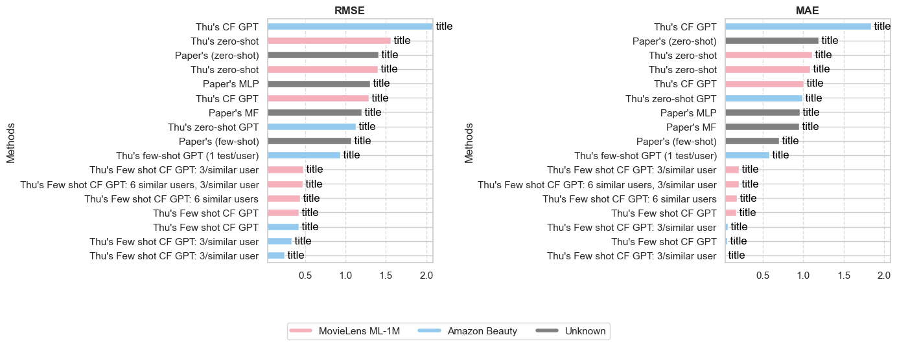

# Recommender System Evaluation with Open AI API

A collection of performance comparisons on rating prediction for various recommender system methods.

**Latest Update**: To enhance the predict_ratings_with_collaborative_filtering_and_save function so that it prioritizes items from similar users that are most correlated with the predicted item, we need to modify the approach of selecting historical ratings from similar users. Instead of randomly sampling their ratings, we should select ratings for items that are most similar (based on the Pearson Correlation Coefficient) to the item for which we are making the prediction.

In this updated version, for each similar user, the function finds the item most correlated to the predicted item and uses its rating. This approach assumes that similar users' preferences for items highly correlated to the predicted item will be more indicative of their potential rating for the predicted item.

Note: This code assumes that pcc_matrix contains item-item Pearson correlations, which might not be the case in our original setup. If pcc_matrix represents user-user correlations, we need to compute a separate item-item Pearson correlation matrix to find the most similar items.



<details><summary><b> Prompting Strategy for Rating Predictions </b></summary>
<p>

### Overview

We employ a zero-shot and few-shot prompting strategy to predict product ratings based on product titles and user's rating history. These strategies utilize GPT models to generate predictions by crafting specific prompts that guide the model towards the desired output.

The system_fingerprint in OpenAI's API response is used to identify the specific backend configuration of the model, helping users track changes in the model's infrastructure that might affect the reproducibility of results.

### Zero-Shot Prompting

In the zero-shot approach, the model is prompted without any prior examples or context. It relies solely on the given prompt to make a prediction.

**Example:**
```python
    prompt = f"How will users rate this product based on the following details: '{combined_text}'? (1 being lowest and 5 being highest) Attention! Just give me back the exact whole number as a result, and we don't need a lot of text."
```

### Few-Shot Prompting

In the few-shot approach, the model is provided with a user's past rating history along with the product title. This additional context helps the model make more informed predictions.

**Example:**
```python
    prompt = (f"Here is the user's rating history: {rating_history}. "
              f"Based on the above rating history and the following information: '{combined_text}', "
              f"how many stars would we rate the product? "
              "(Provide a number between 1 and 5, either followed by the word 'stars' or preceded by the words 'would be'). "
              "Attention! Keep the response concise.")
```
</p>
</details>

<details><summary><b> Data </b></summary>
<p>
Amazon Dataset Description
The Amazon dataset used in this project is divided into two sets: Small Amazon and Large Amazon.

1. **Small Amazon Dataset:**

This dataset is a subset of the main dataset where the 'reviewerID' column is used to filter out users.
Only users with more than 5 ratings are considered.
From these users, records of only 5 unique users are randomly selected using a specific seed.
Dataset Statistics:
+ Number of unique users: 5
+ Number of unique products: 23
+ Number of unique ratings: 4
+ Unique rating values: [5.0, 2.0, 3.0, 4.0]

2. **Large Amazon Dataset:**

This dataset includes all data that has a 'reviewerID'.
Only users with 5 or more ratings are considered.
Dataset Statistics:
+ Number of unique users: 1608
+ Number of unique products: 1879
+ Number of unique ratings: 5
+ Unique rating values: [1.0, 5.0, 4.0, 2.0, 3.0]

Source: https://cseweb.ucsd.edu/~jmcauley/datasets/amazon_v2/


We're attempting to predict product ratings based on item attributes, while avoiding interaction and user-specific details. This makes sense for a zero-shot prediction approach.

**Item Side:**
| Column Name     | Description                                       |
|-----------------|---------------------------------------------------|
| asin            | Unique product ID                                 |
| title           | Name of the product                               |
| feature         | Bullet-point format features of the product       |
| description     | Description of the product                        |
| price           | Price of the product in US dollars                |
| imageURL        | URL of the product image                          |
| imageURLHighRes | URL of the high resolution product image          |
| related         | Related products (also bought, also viewed, etc.) |
| salesRank       | Sales rank information                            |
| brand           | Brand name of the product                         |
| categories      | List of categories the product belongs to         |
| tech1           | The first technical detail table of the product   |
| tech2           | The second technical detail table of the product  |
| similar         | Similar product table                             |
| also_buy        | Products also bought with this item               |
| also_view       | Products also viewed by users who viewed this item|
| details         | Additional details about the product              |
| main_cat        | Main category of the product                      |
| similar_item    | Similar items related to the product              |
| date            | Release date or manufacturing date of the product |
| rank            | Ranking information of the product                |


**Interaction Side:**
| Column Name     | Description                                       |
|-----------------|---------------------------------------------------|
| reviewText      | Text of the review                                |
| overall         | Rating of the product                             |
| summary         | Summary of the review                             |
| unixReviewTime  | Time of the review in unix time                   |
| reviewTime      | Time of the review in raw format                  |
| vote            | Helpful votes count for the review                |
| style           | A dictionary of the product metadata              |
| image           | Images posted by users after receiving the product|

**User Side:**
| Column Name   | Description                               |
|---------------|-------------------------------------------|
| reviewerID    | Unique ID of the reviewer                 |
| reviewerName  | Name of the reviewer                      |
| verified      | Indicates if the review is verified or not|


**Determining the importance of features that impact the rating of a product**
| Feature                  | Description                                                                                                                                       |
|--------------------------|---------------------------------------------------------------------------------------------------------------------------------------------------|
| `title`                  | The product title is the first thing customers see. A clear and accurate title can set appropriate expectations.                                  |
| `brand`                  | Established and reputable brands might receive higher ratings due to brand loyalty and trustworthiness.                                            |
| `price`                  | The cost of the product can influence ratings. If customers feel they received good value for their money, they might rate the product higher.     |
| `feature`                | Special features or unique selling points of the product can impact its utility and the customer's satisfaction.                                  |
| `rank`                   | Products with better sales ranks might be more popular and, therefore, have higher or more consistent ratings.                                     |
| `also_buy` and `also_view` | Products frequently bought or viewed together can provide insights into user preferences and the potential quality or utility of a product.      |
| `main_cat`               | The main category of the product might influence ratings as some categories may inherently have higher or lower ratings.                           |
| `details`                | Detailed specifications or additional information about the product can help set correct customer expectations.                                    |
| `similar_item`           | If customers often compare the product with similar items, it can provide insights into the competitive landscape and the product's standing among its peers. |


</p>
</details>


<details><summary><b> Prompt design</b></summary>
<p>

**References**
https://learn.deeplearning.ai/chatgpt-prompt-eng/lesson/1/introduction

</p>
</details>

<details><summary><b> OpenAI API Performance Comparison on Rating Prediction</b></summary>
<p>

| **Methods**                                          | **Dataset**           | **Feature(s)** | **Model Name**        | **Hyperparameter(s)**                                    | **RMSE** | **MAE** | **Wall Time** |
|------------------------------------------------------|-----------------------|--------------|-----------------------|---------------------------------------------------|------------|-----------|----------------|
| MF [1]                                               | Unknown               | title        | -                     | -                                                 | 1.1973     | 0.9461    | -              |
| MLP [2]                                              | Unknown               | title        | -                     | -                                                 | 1.3078     | 0.9597    | -              |
| Paper's (zero-shot) [3]                              | Unknown Amazon        | title        | GPT-3.5-turbo                     | -                                                 | 1.4059     | 1.1861    | -              |
| Paper's (few-shot) [3]                               | Unknown Amazon        | title        | GPT-3.5-turbo                     | -                                                 | 1.0751     | 0.6977    | -              |
| Thu's OpenAI embedding                               | Small Amazon          | title        | RandomForestRegressor | BATCH_SIZE=10, N_ESTIMATORS=10, MAX_TOKENS=8000    | 1.6036       | 1.1429      | 47.9 ms        |
| Thu's zero-shot GPT                                  | Small Amazon          | title        | GPT-3.5-turbo         | TEMPERATURE=0, MAX_TOKENS=8000                     | 1.3351     | 1.2609    | 13.6 s              |
| Thu's few-shot GPT                                   | Small Amazon          | title        | GPT-3.5-turbo         | TEMPERATURE=0, MAX_TOKENS=8000                     | 1.9086     | 1.0714    | 16.4 s              |
| Thu's OpenAI embedding                               | Large Amazon          | title        | RandomForestRegressor | BATCH_SIZE=10, N_ESTIMATORS=10, MAX_TOKENS=8000    | 0.6240       | 0.3107      | 1h 25min 35s              |
| Thu's zero-shot GPT                                  | Large Amazon          | title        | GPT-3.5-turbo         | TEMPERATURE=0, MAX_TOKENS=8000                     | 1.1344     | 1.0118    | 13h 14min 39s              |
| Thu's few-shot GPT                                   | Large Amazon          | title        | GPT-3.5-turbo         | TEMPERATURE=0, MAX_TOKENS=8000                     | 0.7185     | 0.3259    | 9h 36min 7s             | 
| Thu's few-shot GPT (1 test/user)                                    | Large Amazon          | title        | GPT-3.5-turbo         | TEMPERATURE=0, MAX_TOKENS=8000                     | 0.6445     | 0.2226    | 15h 37s              | 
| Thu's zero-shot GPT                                  | Small Amazon            | title, reviewText        | GPT-3.5-turbo         | TEMPERATURE=0, MAX_TOKENS=8000                     | 1.3758     | 1.0118    | 12min 21s              |
| Thu's few-shot GPT                                   | Small Amazon           | title, reviewText        | GPT-3.5-turbo         | TEMPERATURE=0, MAX_TOKENS=8000                     | 1.9457     | 0.9286    | 10min 30s              | 
| Thu's few-shot GPT (1 test/user)                                  | Small Amazon           | title, reviewText        | GPT-3.5-turbo         | TEMPERATURE=0, MAX_TOKENS=8000                     | 0.6325     | 0.4   | 9.59 s             | 
| Thu's OpenAI embedding                                 | Small Amazon           | title, reviewText        | RandomForestRegressor         | BATCH_SIZE=10, N_ESTIMATORS=10, MAX_TOKENS=8000                    | 0.8856     | 0.4714   | 10.8 s             | 


**References:**

[1] Yehuda Koren, Robert Bell, and Chris Volinsky. 2009. Matrix factorization techniques for recommender systems. Computer 42, 8 (2009), 30–37.

[2] Heng-Tze Cheng, Levent Koc, Jeremiah Harmsen, Tal Shaked, Tushar Chandra, Hrishi Aradhye, Glen Anderson, Greg Corrado, Wei Chai, Mustafa Ispir, et al. 2016. Wide & deep learning for recommender systems. In Proceedings of the 1st workshop on deep learning for recommender systems. 7–10.

[3] [https://arxiv.org/pdf/2304.10149.pdf](https://arxiv.org/pdf/2304.10149.pdf)

</p>
</details>

<details><summary><b>Tasks</b></summary>
<p>

# Content-Based Recommendation Systems

# Collaborative Filtering (CF) Recommendation Systems
To adapt our existing OpenAI GPT-based product rating prediction system into a Collaborative Filtering (CF) approach for a recommender system, we need to shift the focus from analyzing individual product attributes to leveraging user-item interactions. Collaborative Filtering primarily uses past interactions (such as ratings) from users to make recommendations. This approach can be user-based, item-based, or a hybrid.

User-Based CF: This involves finding similar users based on their ratings and recommending items that these similar users liked.

Item-Based CF: This involves finding similar items based on how users rated them and recommending these similar items to users.

Matrix Factorization: A more advanced approach, often used in modern recommender systems, where user-item interactions are represented in a matrix, and matrix factorization techniques are used to predict missing ratings.

Incorporate Embeddings: we can use GPT to generate embeddings for items based on their descriptions and other features, and then use these embeddings to find similar items or to enhance the user-item interaction matrix.


# User-Based Collaborative Filtering Recommender System

## Overview
User-Based Collaborative Filtering with item feature vectors is an advanced technique in recommender systems. It not only considers the ratings given by users to items but also incorporates additional features of the items to enhance the recommendation process.

## User-Item Rating Matrix with Item Features
In this approach, we extend the user-item rating matrix to include a feature vector for each item. Let's denote the extended matrix as \( R \) and the feature vector for item \( i \) as \( \mathbf{f}_i \).

### Matrix Representation
The matrix \( R \) is represented as follows, where \( r_{ij} \) is the rating given by user \( j \) to item \( i \), and \( \mathbf{f}_i \) is the feature vector of item \( i \):


$$
R = 
\begin{pmatrix}
r_{11} & r_{12} & \cdots & r_{1n} & \mathbf{f}_1 \\
r_{21} & r_{22} & \cdots & r_{2n} & \mathbf{f}_2 \\
\vdots & \vdots & \ddots & \vdots & \vdots \\
r_{m1} & r_{m2} & \cdots & r_{mn} & \mathbf{f}_m
\end{pmatrix}
$$


- m represents the total number of items.
- n represents the total number of users.
- r_ij is the rating of the i-th item by the j-th user.
- f_i represents the feature vector of the i-th item.

### Item Feature Vectors
- Feature vectors f_i can include various attributes like title, category, price, etc.
- The dimensionality and nature of these features can vary depending on the application.

## Methodology
1. **Feature Vector Integration**: Incorporate item features into the recommendation algorithm, enriching the user-item interactions with additional item information.
2. **Similarity Computation**: Compute the similarity between users based on their ratings and item features.
3. **Neighborhood Selection**: Select a subset of users (neighbors) who are most similar to the active user, considering both ratings and item features.
4. **Prediction Computation**: Predict the ratings of items not yet rated by the active user, using both user similarity and item features.

## Applications
- Movie Rating Prediction
- E-commerce Amazon Beauty Rating Prediction


## Limitations
- Complexity: Increased computational complexity due to additional item features.
- Feature Selection: The need for effective selection and representation of item features.
- Cold Start Problem: Difficulty in recommending new items with limited feature information.

</p>
</details>


<details><summary><b>SVD in Recommender System</b></summary>
<p>


</p>
</details>


<details><summary><b>RELATED WORK</b></summary>
<p>
[2305.02182] Uncovering ChatGPT's Capabilities in Recommender Systems (arxiv.org)

Uncovering ChatGPT’s Capabilities in Recommender Systems | Proceedings of the 17th ACM Conference on Recommender Systems

[2309.03613] Evaluating ChatGPT as a Recommender System: A Rigorous Approach (arxiv.org)
(GitHub - sisinflab/Recommender-ChatGPT: The official source code and datasets for the paper titled "Evaluating ChatGPT as a Recommender System: A Rigorous Approach")

[2304.10149] Is ChatGPT a Good Recommender? A Preliminary Study (arxiv.org)
</p>
</details>


## non-LaTeX example from training_data.jsonl:

  ```
  {
    "prompt": "Title: Charming Silver Colored Earring / Ear Cuff / Clip In Snake / Spiral Shape By VAGA", 
    "completion": "5.0"
  }
  ```

## Repository Structure

- `LICENSE`: Licensing details.
- `README.md`: Description of the project, setup instructions, and other details.

Please check the repository regularly for updates and performance improvements.

